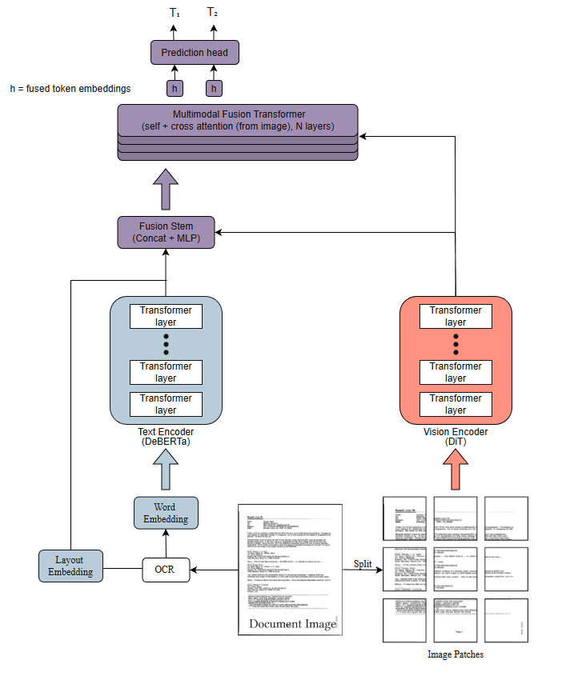

# DocFusion-Lite

*A custom multimodal document understanding architecture for scanned medical forms, optimized for lower training cost.*

DocFusion-Lite is a **Document AI** model that fuses:

- **OCR text** via a DeBERTa-based text encoder  
- **Document images** via a DiT-style vision transformer over patches  
- **Layout information** via bucketized bounding-box embeddings  

These three streams are combined through a multi-layer multimodal fusion transformer stack. The design is **inspired by LayoutLMv3**, but the implementation is **entirely original** and built from scratch using **MIT/Apache-friendly components**, so it can be used and extended in commercial settings.

> **Status:** The architecture and data pipeline are implemented and tested on synthetic data, but the model has **not yet been fully trained** on real documents. This is an engineering & research prototype, not a production-ready system.

--- 
## Architecture at a Glance

<p align="center">
  
</p>


> *DocFusion-Lite encodes OCR tokens, layout, and image patches in separate backbones, then fuses them with a multimodal transformer stack for downstream tasks.*

---

## Motivation, Constraints & Design Goals

Scanned medical documents—records, request and authorization forms, invoices, and mixed attachments—are noisy, visually dense, and highly inconsistent in layout. They combine OCR errors, stamps, checkboxes, tiny form fields, tables, and other visual cues that don’t fit cleanly into plain-text NLP. As a result, many organizations still review these documents manually to:

- Determine **fees/prices** for fulfilling requests  
- Extract **codes**, providers, dates, and other structured fields  
- Verify that required documents and sections are present  

At scale, this work is slow, expensive, and hard to keep consistent.

In theory, large LayoutLMv3-style multimodal models could help. In practice, two main constraints make this difficult:

- **Compute** – training and maintaining full-scale multimodal models on real document corpora typically requires A100-class GPUs and significant GPU hours, which is unrealistic for many smaller teams or early-stage products.  
- **Licensing** – many SOTA document models ship with non-commercial or restricted weights, making them awkward as the core of commercial workflows even if you can afford the compute.

DocFusion-Lite is designed specifically for this gap. The architecture is intentionally:

- **Multimodal** – jointly models text, layout, and image content  
- **Efficient** – cheaper to train and iterate on than full LayoutLMv3-style stacks  
- **Modular** – clean separation of text encoder, vision encoder, fusion stack, pooling, and heads (with support for freezing backbones)  
- **Commercially safe** – built on MIT/Apache-friendly components  
- **Practical** – targeted at scanned medical forms and extraction of fees, codes, providers, dates, and related fields  

---

## Architecture Overview

DocFusion-Lite follows a simple pattern:


- A **text stream** encodes OCR tokens with a DeBERTa-based encoder, supplemented with layout embeddings so the model knows *where* each token appears on the document.
- A **vision stream** encodes the page image as patches with a DiT/ViT-style transformer, capturing tables, checkboxes, and other visual structure.  
- A **fusion transformer** stacks multimodal transformer layers where text tokens run self-attention over the text sequence and cross-attention over the image patches, letting each token see the visual context that corresponds to it.

Because DocFusion-Lite reuses **pretrained DeBERTa and DiT backbones** and trains a comparatively small fusion stack on top (with optional backbone freezing), it is much cheaper to adapt on modest GPUs than training a large multimodal model end-to-end from scratch.

For a more detailed breakdown (including the fusion stem, attention patterns, and design tradeoffs), see `docs/architecture.md`.

---

## Tech Stack

- **Language / Framework**: Python, PyTorch  
- **Text**: DeBERTa (via Hugging Face Transformers)  
- **Vision**: DiT/ViT-style transformer over image patches  
- **Layout**: normalized, bucketized bounding-box embeddings  
- **Testing / Dev**: synthetic forward-pass checks, simple shape/consistency tests  

---

## What’s Here Right Now

- Full **PyTorch model implementation**:
  - DeBERTa-based text encoder wrapper  
  - DiT-style vision encoder over image patches  
  - Layout / bounding-box embedding module  
  - Multi-layer multimodal fusion transformer  

- Supporting **infrastructure**:
  - Data pipeline for OCR tokens, bounding boxes, and images  
  - Collation logic for batching, padding, and masks  
  - Synthetic forward-pass demo scripts  
  - Basic shape / wiring tests to validate end-to-end integration  

Large-scale pretraining, fine-tuning on real labeled medical documents, and benchmark metrics are future work once domain data is available.

## FUNSD Overfit Sanity Check

To validate that the architecture, data pipeline, and optimization loop are wired correctly, this repository includes a small overfit test on the FUNSD dataset.

The goal of this experiment is not performance benchmarking, but a standard deep learning sanity check: verifying that the model can successfully memorize a small dataset when trained in a highly constrained setting.

## Quickstart (Dev / Demo)

```bash
git clone https://github.com/
cd DocFusion-Lite

python -m venv .venv
source .venv/bin/activate  # Windows: .venv\Scripts\activate
pip install -r requirements.txt
```

Run an overfit test on funsd using 3.1 :
```bash
python scripts/funsdoverfit.py
```

Repo Layout (High-Level)

```text
DocFusion-Lite/
├─ README.md
├─ docs/                # diagrams, architecture notes
├─ configs/             # training / debug configs
├─ scripts/             # funsdoverfit.py
├─ src/
│  ├─ data/             # dataset + collation
│  ├─ models/           # encoders, fusion, pooling, heads
│  └─ utils/            # geometry and helpers
└─ tests/               # shape and pipeline tests
```

